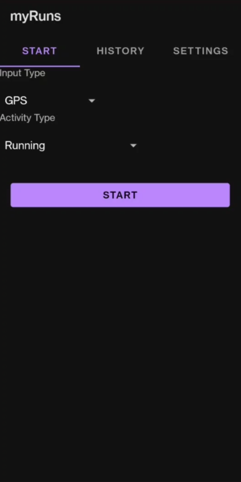
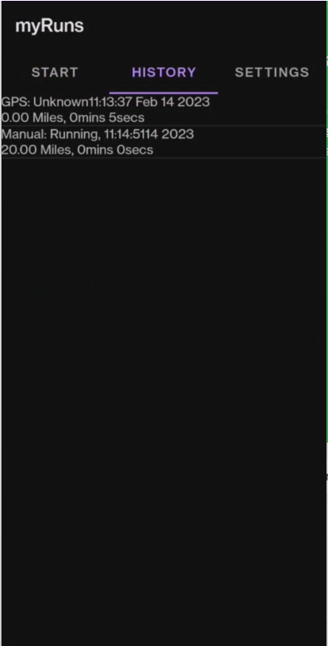
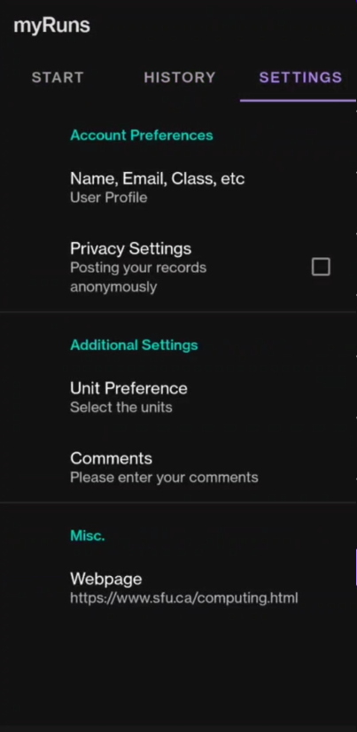
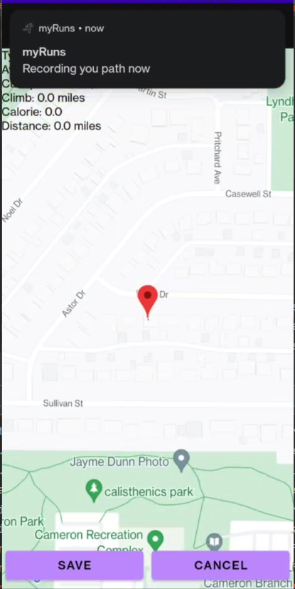

# myRuns

myRuns is an exercise app for android. 
It allows users to track their exercise activity and displays
the user's location in a map. Previous entries are stored in the history tab 
and a settings tab allows the user to edit the app to their preferences

  
  
  
 </0>

This app utilizes the GoogleMaps API to display the user's location and track their movement in order to display the speed,
distance, etc. The app also features activity recognition that detects whether the user is sitting, walking, or running through a classification model in Weka.

  
  

